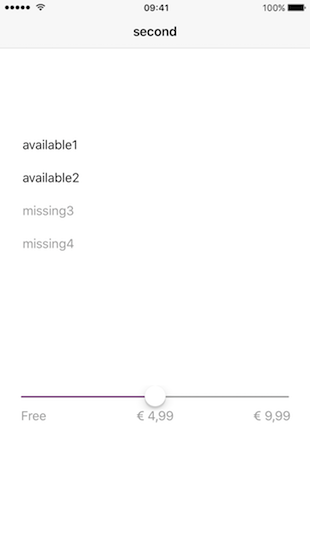

# SJIPAPresenter

[](https://travis-ci.org/sjoerdjanssenen/SJIPAPresenter)
[](http://cocoapods.org/pods/SJIPAPresenter)
[](http://cocoapods.org/pods/SJIPAPresenter)
[](http://cocoapods.org/pods/SJIPAPresenter)
[](http://cocoapods.org/pods/SJIPAPresenter)

## Example

To run the example project, clone the repo, and run `pod install` from the Example directory first.

## Requirements

## Installation

SJIPAPresenter is available through [CocoaPods](http://cocoapods.org). To install
it, simply add the following line to your Podfile:

```ruby
pod "SJIPAPresenter"
```

## Author

sjoerdjanssenen, sjoerd.janssen@stimuliz.nl

## License

SJIPAPresenter is available under the MIT license. See the LICENSE file for more info.
